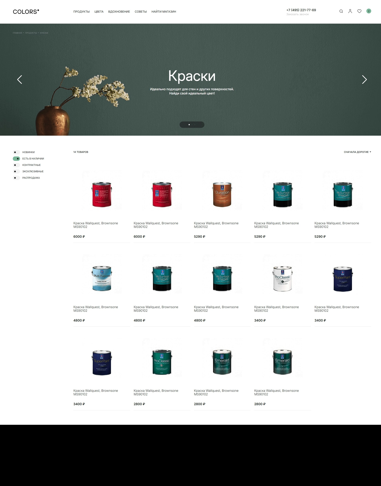

# Тестовое задание its.agency

### Описание:

Необходимо сверстать и запрограммировать страницу каталога

Макет: https://www.figma.com/file/qMhAdsVAsaAkfotB13sO8W

### Функции:

- слайдер
- фильтрация по типам товаров
- сортировка по убыванию и возрастанию цены
- добавление товара в корзину
- открытие и закрытие модального окна с корзиной, фильтров и меню на мобильном
- изменение количества товаров в корзине
- расчет стоимости товаров в корзине
- удаление товара из корзины

### Требования:

- реализация на чистом JS (ES5/ES6)
- использование тестового API (например, MockAPI)
- вся логика должна быть написана самостоятельно, без использования библиотек (исключение — слайдер и Axios для получения данных с тестового API)
- круто, если будет использован шаблонизатор верстки (мы используем Pug)
- наименование классов по БЭМ
- обязательно использовать Sass/Scss
- адаптивность
- сохранение пропорций изображений при изменении ширины экрана
- соответствие макету
- использовать компонентный подход
- минимальная кроссбраузерность (последние версии Chrome, Safari и Firefox)

---

### Stack:

- JS
- HTML
- SCSS
- Vite

Ссылка на GitHub Pages - https://phildesign.github.io/itsagency-test-task/
